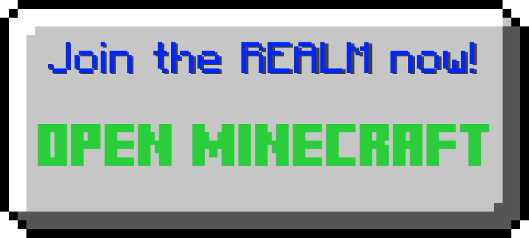

<!DOCTYPE html>
<html>
<head>
<title> Ulorium Games Official </title>
<link rel="shortcut icon" href="https://cdn.discordapp.com/attachments/796149014558277677/818232928474759168/UloriumGames_logo_endereyes_ICO.ico" />

</head>

<body>

    

        <!--svg width="2080" height="200"> <rect width="2080" height="200" style="fill:rgb(43,145,0);stroke-width:10;stroke:rgb(33,112,0)" /> </svg> style="display:block;margin-left:auto;margin-right:auto;width: 35%-->
        

        

        

    

  

  

</body>
</html>	